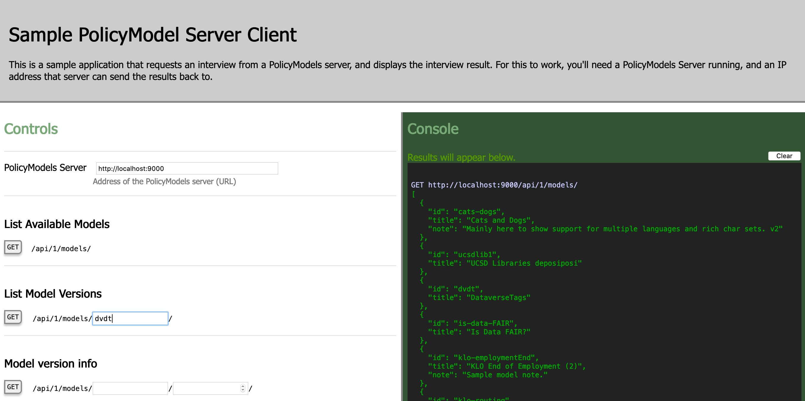
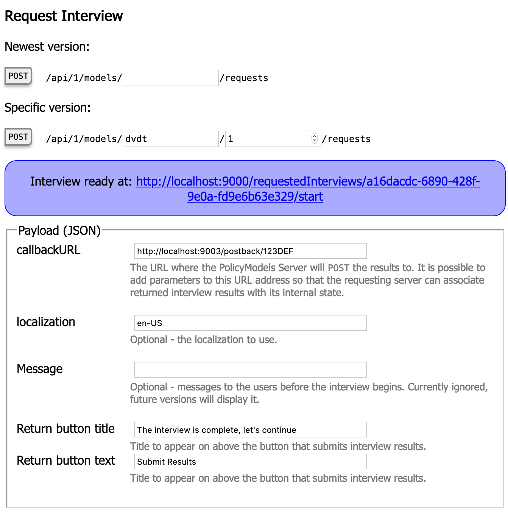

# SamplePoMoSClientApp

This is a very simple web application that demonstrates how PolicyModels Server's API can be used. It allows users to see what models are available, obtain models and version metadata, and request an interviews.

This application is intended as a reference for people who need to write client software that integrates with a PolicyModels Server.

# How to run this

You'll need:

* [Java 11](https://adoptopenjdk.net) or later.
* [SBT](https://www.scala-sbt.org/index.html)
* A running [PolicyModels Server](https://github.com/IQSS/DataTaggingServer/) running somewhere it can post back to this app (easy option: on the same computer).
* The code here, downloaded to your computer.
* Run this application:
  1. Using a terminal, navigate to the `samplepomosclientapp` folder in the downloaded repo.
  1. Type `sbt`. SBT loads the project and may initialize some data, this may take a while.
  2. Type `run -Dplay.server.http.port=9001`. This runs the application locally, on port 9001.
  3. Navigate to http://localhost:9001 using your browser.

# Screenshots

Controls and console:

Interview request UI

