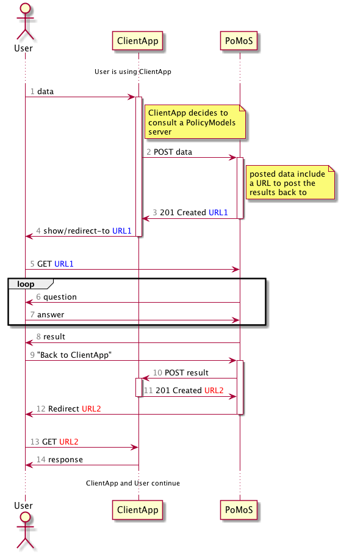

# How to Request an Interview and Get the Results Back

PolicyModels Server can accept interview requests via API, and return the interview results. This allows other applications to use PolicyModels as part of their flow, without dealing with the overhead of loading and presenting an interview.

A [reference implementation](/SamplePoMoSClient) implementing this flow is available in this repo.

## Setup

* An application `ClientApp` needs a policy model filled. This may be for an determining a DataTag, properties of a legal situation, or any other case.
* `ClientApp` has b-directional communicate with a PolicyModels server `PoMoS`.
* `ClientApp` is aware of a specific policy model version that `PoMoS` serves. That version has to by public on `PoMoS`. This is required since `ClientApp` will probably have some well-defined semantics for each value in each slot (e.g. `Encrypt` in slot `Network` means *transfer file only over HTTPS*). Thus, `ClientApp` needs to know exactly the policy space the result will be in.

## Interview Request/Result Process

The process it presented in the sequence diagram below. For those who want more details, here's a textual description of the process after the diagram.




### Textual Flow
1. prepare the interview data, as in the file `InterviewRequest.json`.
2. `POST` the json to `api/1/interviewRequest/model-id/version-id`, capture the `201 Created` response data. Note that `model-id` is a string, and `version-id` is an integer.

  ```bash
  curl -i -X POST --data-binary @InterviewRequest.json http://localhost:9000/api/1/interviewRequest/cats-dogs/1
  ```

3. Sample response:

  ```http
  HTTP/1.1 201 Created
  Date: Mon, 27 Aug 2018 18:32:53 GMT

  /requestedInterview/376ac6e3-c434-4120-a836-ac230a8c3f55
 ```

4. Redirect the user to the URL in the response body (plus the PolicyModels server base URL).
5. Await a `POST` of the interview results into the `callbackURL` provided in the json. This `POST` can have two forms:

  * When accepting:

    ```json
    {
      "status": "accept",
      "value":{
        policy model value goes here
      }
    }
    ```

  * When rejecting:

    ```json
    {
        "status":"reject",
        "reason":"rejection reason string"
    }
    ```
6. Reply with a `201 Created` response, where the body of the response is the *absolute* URL the user should be redirected to. The absolute URL allows the requesting server to forward the user to yet another server, in case this is needed.

---
A [reference implementation](/SamplePoMoSClientApp) of a client app is available in this repo, under `/SamplePoMoSClientApp`
